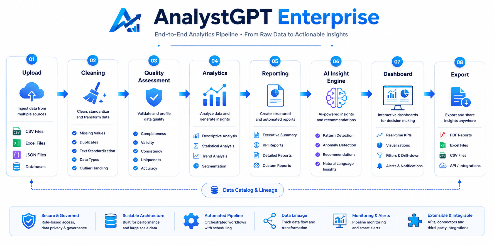
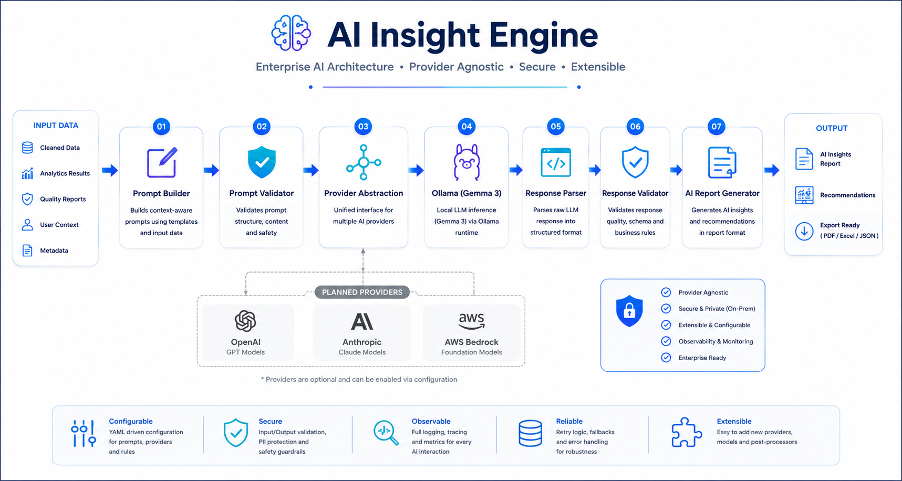

<p align="center">
  
</p>

<h1 align="center">AnalystGPT Enterprise</h1>

<p align="center">
  <strong>A governed analytics platform that turns raw datasets into validated statistics,<br>
  publication-grade reports and grounded AI insights — behind a secure, multi-user REST API.</strong>
</p>

<p align="center">
  
  
  
  
  
  
  <br>
  
  
  
  
</p>

<p align="center">
  <a href="#-quick-start">Quick start</a> ·
  <a href="#-how-it-works">How it works</a> ·
  <a href="#-rest-api">REST API</a> ·
  <a href="#-architecture">Architecture</a> ·
  <a href="#-quality--testing">Quality</a> ·
  <a href="#-roadmap">Roadmap</a> ·
  <a href="#-documentation">Docs</a>
</p>

---

## Why AnalystGPT Enterprise

Most "AI analytics" tools hand a spreadsheet to a language model and hope. AnalystGPT
Enterprise does the opposite: **every number is computed deterministically first**, cleaning is
**reviewed and traceable**, and the model only ever *interprets* statistics it is given — then
its output is checked against them.

| | |
|---|---|
| 🧮 **Deterministic first** | Upload → Cleaning → Quality → Analytics → Reporting runs and persists before any AI is involved. An AI failure never fails a pipeline run. |
| 🛡️ **Governed data** | Immutable raw dataset versions (SHA-256), explicit cleaning policies, a non-destructive preview, before/after quality metrics and end-to-end lineage. |
| 🤖 **Grounded AI** | Privacy-safe aggregated context (never raw rows), deterministic statistical wording, and a validator that flags contradicted or unsupported claims. |
| ⚡ **Asynchronous AI** | AI generation runs as a persisted background job — `PENDING → GENERATING → READY / FAILED` — with retry and polling. Results appear immediately; insights follow. |
| 🔐 **Multi-user by design** | PBKDF2-HMAC-SHA256 passwords, signed bearer tokens with revocation, `ADMIN` / `ANALYST` / `VIEWER` roles, and server-side ownership scoping on every query. |
| 📄 **Publication-grade output** | Multi-page PDF and text reports with charts, KPI summaries, governance tables and lineage cards; Power BI-ready endpoints. |

---

## 🚀 Quick start

**Prerequisites:** Python 3.11+. Optional: [Ollama](https://ollama.com) with `gemma3:4b` for AI
insights, Docker for the full stack.

### Option A — Docker Compose (full stack)

```bash
git clone https://github.com/amaljosekichu66-sketch/AnalystGPT_Enterprise.git
cd AnalystGPT_Enterprise
cp .env.example .env            # set AUTH_SECRET_KEY outside development
docker compose up -d --build
```

| Service | URL |
|---|---|
| Streamlit UI | http://localhost:8501 |
| REST API (Swagger) | http://localhost:8000/docs |
| Health | http://localhost:8000/api/health |

PostgreSQL runs as an internal service and is not exposed on a host port.

### Option B — Local development

```bash
git clone https://github.com/amaljosekichu66-sketch/AnalystGPT_Enterprise.git
cd AnalystGPT_Enterprise
python -m venv venv
source venv/bin/activate        # Windows: .\venv\Scripts\Activate.ps1
pip install -r requirements.txt
cp .env.example .env            # defaults to SQLite + development mode

uvicorn src.api.server:app --reload            # API  → http://127.0.0.1:8000/docs
streamlit run src/frontend/streamlit_app.py    # UI   → http://localhost:8501
python main.py                                 # CLI  → runs the pipeline on sample_data/customer_data.csv
```

For AI insights, run Ollama locally and pull the default model:

```bash
ollama pull gemma3:4b
```

Full, platform-specific commands (including Windows PowerShell) are in the
[Developer Runbook](docs/development/DEVELOPER_COMMANDS.md).

---

## 🔍 How it works

<p align="center">
  
</p>

```text
 Upload ──► Profiling ──► Governance ──► Cleaning ──► Quality ──► Analytics ──► Reporting ──► Persist
 CSV/XLSX    semantic      policy +        applied      before /     stats,        PDF / TXT      runs,
 JSON        types, roles  preview,        policy       after        correlation,  exports,       reports,
             (PII-aware)   versioning                   metrics      distribution  Power BI       lineage
                                                                                         │
                                                        background AI job ◄──────────────┘
                                          PENDING → GENERATING → READY / FAILED   (polled by the UI)
```

1. **Upload & profile** — files are ingested and stored as an immutable dataset version; the
   semantic profiler separates domain meaning (identifier, postal code, contact field, measure,
   dimension…) from pandas dtypes, so a postal code is never charted as a number.
2. **Govern & clean** — cleaning policies are explicit and versioned; a non-destructive preview
   shows the effect before execution, and every execution records rows removed, columns changed
   and quality before vs. after.
3. **Analyse & report** — descriptive, numerical, categorical, correlation and distribution
   analysis feed a report with a planned, bounded chart set (4–8 charts).
4. **Interpret** — an asynchronous job builds a privacy-safe `AIDataContext`, serializes the
   statistics with authoritative wording, calls the configured LLM, and validates the result.

---

## 🤖 AI Insight Engine

<p align="center">
  
</p>

| Stage | Component | What it guarantees |
|---|---|---|
| Context | `context_builder.py` → `AIDataContext` | Aggregated, tenant-scoped statistics and data-quality metadata — no raw rows reach the model. |
| Wording | `statistical_interpretation.py` | Skewness and kurtosis described deterministically and correctly; identifier-like columns flagged. |
| Serialization | `ReportSerializer`, `PromptBuilder` | Category cardinality kept distinct from frequency; explicit anti-hallucination rules. |
| Provider | `BaseLLM` → `LLMFactory` → `OllamaClient` | Engines depend only on the interface; the provider is configuration-driven (`LLM_PROVIDER`). |
| Engines | `AIManager` | Executive summary, recommendations, explanations, narrative. |
| Validation | `insight_validator.py` | Contradictions and unsupported conclusions recorded on the report's `limitations`, never silently dropped. |
| Lifecycle | `AIJobService`, `AIJobExecutor` | Persisted state machine, atomic claim, retry, stale-job recovery. |

**Current provider:** Ollama (`gemma3:4b`, local inference).
**Planned (Sprint 16):** Google Cloud / Gemini behind the same interface, with a clean path for
further adapters such as Groq.

---

## 🌐 REST API

The API is the single contract for every client — Streamlit today, React later, Power BI
alongside. All functional routes live under `/api`; the contract is frozen in
[`docs/api/openapi.json`](docs/api/openapi.json) (OpenAPI 3.1, 33 paths).

| Area | Endpoints |
|---|---|
| **System** | `GET /` · `GET /api/health` · `GET /api/version` |
| **Authentication** | `POST /api/auth/register` · `POST /api/auth/login` · `GET /api/auth/me` · `POST /api/auth/logout` |
| **Pipeline** | `POST /api/pipeline` |
| **Governance** | `POST /api/governance/preview` · `GET /api/governance/dataset-versions` · `GET /api/governance/dataset-versions/{version_id}` · `GET /api/governance/lineage/run/{pipeline_run_id}` |
| **AI Insights** | `GET /api/ai/jobs/{job_id}` · `GET /api/ai/jobs/latest/status` · `POST /api/ai/jobs/{job_id}/retry` |
| **Reports** | `GET /api/reports` · `GET /api/reports/{report_id}/export/{text\|pdf}` · `GET /api/reports/export/{text\|pdf}` (latest) |
| **Power BI** | `GET /api/powerbi/{dashboard,status,summary,statistics,correlation,distribution,categorical,report,pipeline}` |
| **Administration** (`ADMIN`) | `GET /api/admin/users` · `GET` / `PATCH` / `DELETE /api/admin/users/{user_id}` |

### Example

```bash
# Log in and capture the token
TOKEN=$(curl -s -X POST http://127.0.0.1:8000/api/auth/login \
  -H "Content-Type: application/json" \
  -d '{"username": "<USERNAME>", "password": "<PASSWORD>"}' | jq -r '.access_token')

# Run the pipeline — returns results immediately, plus the AI job to poll
curl -s -X POST http://127.0.0.1:8000/api/pipeline \
  -H "Authorization: Bearer $TOKEN" -H "Content-Type: application/json" \
  -d '{"input_path": "sample_data/customer_data.csv"}' | jq '{success, execution_time, ai_job_id, ai_job_status}'

# Poll the AI job, then download the PDF report
curl -s http://127.0.0.1:8000/api/ai/jobs/<AI_JOB_ID> -H "Authorization: Bearer $TOKEN" | jq .
curl -s -o report.pdf http://127.0.0.1:8000/api/reports/export/pdf -H "Authorization: Bearer $TOKEN"
```

Interactive docs: **Swagger** `/docs` · **ReDoc** `/redoc` · full reference in
[API_REFERENCE.md](docs/api/API_REFERENCE.md).

---

## 🏗️ Architecture

<p align="center">
  
</p>

| Layer | Responsibility | Where |
|---|---|---|
| **Presentation** | Streamlit views and components; presentation logic only | `src/frontend/` |
| **API** | Routing, validation, auth dependencies, error handling | `src/api/` |
| **Application** | Orchestration — `Application.run()`, AI / dashboard / reporting orchestrators | `src/application/` |
| **Business** | Upload, cleaning, quality, analytics, reporting, profiling, governance | `src/upload/` … `src/governance/` |
| **AI** | Insight engines, job lifecycle, context, provider abstraction | `src/ai/`, `src/llm/` |
| **Identity** | Users, hashing, tokens, RBAC, audit | `src/identity/` |
| **Persistence** | Repositories over a database abstraction (SQLite / PostgreSQL) | `src/persistence/`, `src/database/` |
| **Integrations** | Power BI dashboard service | `src/integrations/` |
| **Core** | Configuration, constants, logging, exceptions — imported by all, imports none | `src/core/` |

**Rules the codebase enforces:** dependencies point inward; views hold no business logic;
frontend services talk to the backend only over REST; every repository query is scoped to the
authenticated user; architectural changes are recorded as ADRs
([28 so far](docs/adr/)).

<details>
<summary><strong>Project structure</strong></summary>

```text
AnalystGPT_Enterprise/
├── src/
│   ├── api/            # FastAPI app, routes, schemas, dependencies, exception handlers
│   ├── application/    # Application.run() and orchestrators
│   ├── upload/ cleaning/ quality/ analytics/ reporting/
│   ├── profiling/      # Semantic data profiling
│   ├── governance/     # Cleaning policies, preview, governance service
│   ├── storage/        # Immutable artifact store
│   ├── ai/  llm/       # Insight engine, async jobs, provider abstraction
│   ├── identity/       # Authentication, RBAC, user service
│   ├── persistence/  database/
│   ├── integrations/   # Power BI
│   ├── frontend/       # Streamlit: views, components, services, theme
│   └── core/           # Config, constants, logging, exceptions, PII rule
├── tests/              # pytest suite mirroring src/; live-LLM tests marked `integration`
├── docs/               # adr/ api/ deployment/ development/ engineering/ project/ sprints/
├── performance/        # Benchmarks and performance reports
├── scripts/            # lint.ps1, run_tests.ps1, benchmarks
├── sample_data/        # Example datasets
├── Dockerfile  docker-compose.yml  pyproject.toml  requirements.txt  .env.example
├── main.py             # CLI entry point
└── LICENSE
```

</details>

---

## ✅ Quality & testing

| Gate | Command | Result |
|---|---|---|
| Test suite | `pytest -q` | **714 passed**, 0 failed, 15 deselected |
| Lint | `flake8 src tests` | 0 violations |
| Format | `black --check src tests` | clean |
| Imports | `isort --check src tests` | clean |
| Types | `mypy src` | no issues (210 files) |

The 15 deselected tests are marked `integration` and need a live Ollama server with
`gemma3:4b` — run them with `pytest -m integration`. CI (GitHub Actions) runs quality, tests,
Docker image builds and a full Compose integration check on `main`.

Coverage spans unit, API contract, RBAC and cross-tenant isolation, concurrency, AI job
idempotency and failure isolation, export, and grounding-regression suites. The authoritative,
executed figures live in [PROJECT_STATE.md](docs/engineering/PROJECT_STATE.md#executed-validation--authoritative).

---

## 🗺️ Roadmap

| Sprint | Release | Focus | Status |
|---|---|---|---|
| 0 – 13 | v0.5.0 – v13.0.0 | Foundation → pipeline → persistence → REST API → Power BI → Streamlit → AI engine → Docker/CI → identity & multi-user | ✅ Released |
| **14** | v14.0.0 | Stabilization, data governance & grounded reporting | ✅ Released |
| 15 | v15.0.0 | Enterprise stabilization, governance completion & product/UX remediation | 📋 Planned |
| 16 | v16.0.0 | AI provider abstraction (Ollama + Gemini) & complete React readiness | 📋 Planned |
| 17 | v17.0.0 | React + TypeScript migration & modern presentation layer | 📋 Planned |

Each sprint starts only after the previous one is released; React work does not begin before
Sprint 17. Scope and Definitions of Done: [ROADMAP.md](docs/project/ROADMAP.md).

**Known limitations** (Sprint 15 scope): the governance workflow is not yet verified end-to-end
through the UI; the Dashboard overlaps the pipeline result view; user deletion exists in the API
but not in the Admin UI. See [PROJECT_STATE.md](docs/engineering/PROJECT_STATE.md) for the full
technical-debt list.

---

## 📚 Documentation

| Document | Purpose |
|---|---|
| [PROJECT_STATE.md](docs/engineering/PROJECT_STATE.md) | Current status, executed validation, technical debt |
| [ROADMAP.md](docs/project/ROADMAP.md) | Sprint plan and Definitions of Done |
| [ARCHITECTURE.md](docs/project/ARCHITECTURE.md) | Layers, modules, data flow, dependency rules |
| [API_REFERENCE.md](docs/api/API_REFERENCE.md) · [openapi.json](docs/api/openapi.json) | REST contract |
| [DEVELOPER_COMMANDS.md](docs/development/DEVELOPER_COMMANDS.md) | Setup, run, test and quality-gate commands |
| [DEPLOYMENT_GUIDE.md](docs/deployment/DEPLOYMENT_GUIDE.md) | Docker, configuration, CI |
| [ADRs](docs/adr/) | 28 Architecture Decision Records |
| [CHANGELOG.md](CHANGELOG.md) · [PROJECT_JOURNAL.md](docs/project/PROJECT_JOURNAL.md) | Release history and engineering journal |

---

## 🤝 Contributing

Contributions follow the project's [Definition of Done](docs/project/DEFINITION_OF_DONE.md) and
[Code Review Checklist](docs/project/CODE_REVIEW_CHECKLIST.md):

1. Branch from `main` (`feature/<name>`).
2. Keep business logic out of the presentation layer and every query user-scoped.
3. Add tests; run `pytest -q` and the four quality gates before opening a pull request.
4. Record architectural decisions as an ADR.

---

## 📄 License

Released under the [MIT License](LICENSE).

<p align="center">
  <sub>Built by <a href="https://in.linkedin.com/in/mr-amaljose">Amal Jose</a> ·
  <a href="https://github.com/amaljosekichu66-sketch/AnalystGPT_Enterprise/issues">Report an issue</a></sub>
</p>
