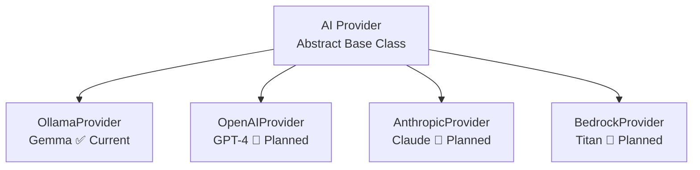
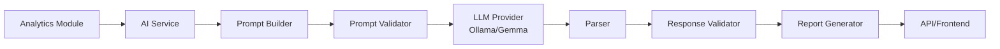
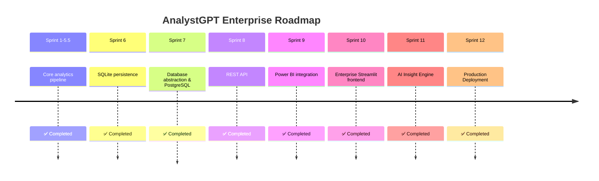

<!-- Banner Image -->
<p align="center">
  
</p>

<h1 align="center">AnalystGPT Enterprise</h1>

<p align="center">
  <strong>Enterprise AI‑powered Analytics Platform</strong><br>
  Built with Python · FastAPI · Streamlit · PostgreSQL · Ollama
</p>

<p align="center">
  <a href="#"></a>
  <a href="#"></a>
  <a href="#"></a>
  <a href="#"></a>
  <a href="#"></a>
  <a href="#"></a>
  <a href="#"></a>
  <a href="#"></a>
</p>

<p align="center">
  <a href="#-key-features">Features</a> •
  <a href="#-installation--quick-start">Quick Start</a> •
  <a href="#-rest-api">API Docs</a> •
  <a href="#-roadmap">Roadmap</a> •
  <a href="#-documentation">Docs</a> •
  <a href="#-license">License</a>
</p>

---

## 📊 Quick Overview

| **Data Pipeline** | **REST API** | **Business Intelligence** | **Modern UI** | **Enterprise Identity & Multi-User** | **AI‑Ready** |
| :---------------: | :----------: | :-----------------------: | :-----------: | :-----------------------------------: | :----------: |
| Ingest, clean, validate & analyse data end‑to‑end | FastAPI with OpenAPI 3.1 & interactive docs | Power BI ready endpoints & dashboard integration | Streamlit frontend – interactive & responsive | PBKDF2 hashing, JWT tokens, RBAC & cross-tenant data isolation | Built for AI insights, recommendations & automation |

- **Architecture**: Layered + REST + BI + Multi-Tenant Identity
- **Database**: SQLite (dev) + PostgreSQL (prod)  
- **Frontend**: Streamlit (React + TypeScript migration planned for Sprint 17)
- **AI Engine**: Ollama + `gemma3:4b` via the `BaseLLM` / `LLMFactory` provider abstraction (Google Cloud / Gemini planned for Sprint 16)
- **Testing**: **714 passed, 0 failed**; 15 live-LLM tests marked `integration` are deselected by
  default (they need a local `gemma3:4b`) —
  see [PROJECT_STATE.md](docs/engineering/PROJECT_STATE.md) § *Executed Validation*

---

## 📸 Screenshots

> **Coming soon** – once the Streamlit application is running, this section will be replaced with real screenshots of the Dashboard, Upload, Reports, and AI Insights pages.

For now, the banner above gives a preview of the enterprise interface.

---

## 📖 Table of Contents

- [🏗️ Layered Architecture](#️-layered-architecture)
- [✨ Key Features](#-key-features)
- [🤖 AI Insight Engine](#-ai-insight-engine)
- [🛠️ Technology Stack](#️-technology-stack)
- [📦 Installation & Quick Start](#-installation--quick-start)
- [🌐 REST API](#-rest-api)
- [📁 Project Structure](#-project-structure)
- [⚡ Performance & Scalability](#-performance--scalability)
- [🗺️ Roadmap](#-roadmap)
- [📚 Documentation](#-documentation)
- [🧑‍💻 Design Principles](#-design-principles)
- [🎓 Resume Value](#-resume-value)
- [🤝 Contributing](#-contributing)
- [📄 License](#-license)

---

## 🏗️ Layered Architecture

The system follows a strict layered architecture ensuring separation of concerns, testability, and maintainability.

<p align="center">
  
</p>

| Layer | Responsibility | Components |
|-------|----------------|------------|
| **Presentation** | User interaction, input validation | Streamlit UI, FastAPI REST endpoints |
| **Application** | Orchestration, use cases, services | PipelineService, DashboardService, AIService |
| **Business** | Core domain logic | Upload, Cleaning, Quality, Analytics, Reporting |
| **Persistence** | Data storage abstraction | Repository interfaces, SQLite/PostgreSQL adapters |
| **Infrastructure** | External services, configurations | AI providers, logging, environment config |

---

## ✨ Key Features

### 📊 Enterprise Analytics Pipeline
- **Multi‑format ingestion** – CSV, Excel, JSON with automatic type detection
- **Automated data cleaning** – Missing values, outliers, duplicate detection
- **Data quality validation** – Completeness, uniqueness, consistency, accuracy
- **Statistical analytics** – Descriptive stats, correlations, distributions
- **Structured reporting** – Executive summaries, KPIs, visualisations

### 🤖 AI Insight Engine (v11.0.0)
- **Provider abstraction** – Ollama integration with Gemma model
- **Prompt engineering** – Structured prompts for consistent output
- **Automated narrative generation** – Executive summaries, recommendations
- **Hallucination prevention** – Prompt validation, response parsing
- **Multi‑provider ready** – OpenAI, Anthropic, AWS Bedrock support planned

### 🌐 REST API
- **FastAPI** with dependency injection and global exception handling
- **OpenAPI 3.1** specification with Swagger UI and ReDoc
- **Type‑safe Pydantic models** for all requests and responses
- **Comprehensive endpoints** – Health, version, pipeline execution, Power BI

### 📈 Business Intelligence
- **Power BI integration** – Dedicated endpoints for BI tools
- **Dashboard service** – Summary statistics, correlations, distributions
- **Categorical analysis** – Value counts, percentages, visualisations
- **Pre‑aggregated metrics** – Optimised for dashboard performance

### 💾 Persistence & Database
- **Repository pattern** – Abstraction over database implementation
- **Dual database support** – SQLite (dev) and PostgreSQL (production)
- **Migration support** – Schema versioning and upgrades
- **Efficient queries** – Indexed fields, query optimisation

---

## 🤖 AI Insight Engine

The AI Insight Engine brings large language model capabilities to analytics interpretation.

### Provider Abstraction



### Processing Pipeline



### Core Components

| Component | Responsibility |
|-----------|----------------|
| **Provider Abstraction** | Interface for multiple LLM providers |
| **Prompt Builder** | Constructs structured, contextual prompts from analytics data |
| **Prompt Validator** | Ensures prompts meet quality and safety standards |
| **Parser** | Extracts structured data from LLM responses |
| **Response Validator** | Validates response format and consistency |
| **Report Generator** | Combines analytics and AI narratives |

---

## 🛠️ Technology Stack

| Category | Technology |
|----------|------------|
| **Language** | Python 3.11 |
| **Web Framework** | FastAPI, Uvicorn |
| **Data Processing** | Pandas, NumPy |
| **Validation** | Pydantic V2 |
| **Frontend** | Streamlit, Matplotlib (charts) |
| **Database** | SQLite (dev), PostgreSQL (prod) |
| **AI** | Ollama, Gemma models |
| **Testing** | pytest, pytest‑cov, HTTPX |
| **Documentation** | Markdown, Mermaid, ADRs |

---

## 📦 Installation & Quick Start

### Quick Start (30 seconds)

```bash
git clone https://github.com/amaljosekichu66-sketch/AnalystGPT_Enterprise.git
cd AnalystGPT_Enterprise
python -m venv venv
source venv/bin/activate  # Windows: venv\Scripts\Activate.ps1
pip install -r requirements.txt
python main.py
```

### Full Development Setup

```bash
# Clone and enter
git clone https://github.com/amaljosekichu66-sketch/AnalystGPT_Enterprise.git
cd AnalystGPT_Enterprise

# Virtual environment
python -m venv venv
# Linux / macOS:
source venv/bin/activate
# Windows PowerShell:
# venv\Scripts\Activate.ps1

# Install dependencies
pip install -r requirements.txt

# Environment configuration
cp .env.example .env
# Edit .env with your settings (PostgreSQL, Ollama, etc.)

# Run the CLI pipeline
python main.py

# Run the REST API
python -m uvicorn src.api.server:app --reload
# Open http://127.0.0.1:8000/docs

# Run the Streamlit frontend
streamlit run src/frontend/streamlit_app.py
# Open http://localhost:8501

# Run tests
pytest

# Run AI Insight Engine (requires Ollama)
ollama run gemma:2b  # Pull the model first
python -c "from src.ai.ai_manager import AIManager; print(AIManager().generate_ai_report(...))"
```

---

## 🌐 REST API

### Endpoints

| Method | Endpoint | Description |
|--------|----------|-------------|
| `GET` | `/` | API root information |
| `GET` | `/health` | Health check |
| `GET` | `/api/v1/version` | Version information |
| `POST` | `/api/v1/pipeline` | Execute full analytics pipeline |
| `GET` | `/api/v1/report/{id}` | Retrieve a specific report |
| `GET` | `/api/v1/reports` | List all reports |
| `GET` | `/api/v1/dashboard/summary` | Dashboard summary statistics |
| `GET` | `/api/v1/dashboard/correlations` | Correlation analysis |
| `GET` | `/api/v1/dashboard/distributions` | Distribution metrics |

*Additional Power BI endpoints are available under `/powerbi`.*

### API Documentation
- **Swagger UI**: http://127.0.0.1:8000/docs
- **ReDoc**: http://127.0.0.1:8000/redoc
- **OpenAPI Spec**: http://127.0.0.1:8000/openapi.json

### Example Request

```bash
curl -X POST http://localhost:8000/api/v1/pipeline \
  -H "Content-Type: application/json" \
  -d '{"file_path": "data/sample.csv", "generate_ai": true}'
```

### Response (abridged)

```json
{
  "status": "success",
  "report_id": "abc-123",
  "analytics": {
    "summary": { "rows": 1000, "columns": 15 },
    "statistics": {...},
    "correlations": [...]
  },
  "ai_insight": {
    "executive_summary": "...",
    "key_findings": "...",
    "recommendations": "..."
  }
}
```

---

## 📁 Project Structure

```text
AnalystGPT_Enterprise/
├── src/
│   ├── api/                    # REST API Layer (FastAPI)
│   │   ├── server.py           # FastAPI app, routers mounted under /api
│   │   ├── routes/             # Endpoint definitions
│   │   ├── models/             # Pydantic request/response schemas
│   │   ├── dependencies/       # DI, auth dependencies
│   │   └── exceptions/         # Exception handlers
│   ├── application/            # Application Layer
│   │   ├── app.py              # Application.run() orchestration
│   │   ├── ai_orchestrator.py
│   │   ├── dashboard_orchestrator.py
│   │   └── reporting_orchestrator.py
│   ├── upload/                 # Business: Data ingestion
│   ├── cleaning/               # Business: Data cleaning
│   ├── quality/                # Business: Quality validation
│   ├── analytics/              # Business: Analytics & statistical interpretation
│   ├── reporting/              # Business: Report generation & PDF/TXT exporters
│   ├── profiling/              # Semantic data profiling
│   ├── governance/             # Cleaning governance, policies, preview
│   ├── storage/                # Immutable artifact store
│   ├── ai/                     # AI Insight Engine, async job lifecycle
│   ├── llm/                    # LLM abstraction (BaseLLM, LLMFactory, Ollama client)
│   ├── identity/               # Authentication, RBAC, user service
│   ├── persistence/            # Persistence manager
│   ├── database/               # Database adapters, schema, repositories
│   ├── integrations/           # External integrations (Power BI)
│   ├── frontend/               # Streamlit UI (views, components, services, theme)
│   └── core/                   # Config, constants, logging, exceptions, PII rule
├── tests/                      # pytest suite, one folder per package
│   ├── integration/            # Live-LLM tests (marker: integration, deselected by default)
│   └── ...
├── docs/
│   ├── adr/                    # Architecture Decision Records
│   ├── api/                    # API reference, OpenAPI contract, React mapping
│   ├── deployment/             # Deployment guide
│   ├── development/            # Developer runbook
│   ├── engineering/            # PROJECT_STATE and engineering manuals
│   ├── project/                # Roadmap, architecture, journal, standards
│   ├── sprints/                # Sprint release reports
│   └── image/                  # Screenshots & diagrams
├── performance/                # Benchmarks and performance reports
├── scripts/                    # lint.ps1, run_tests.ps1, benchmarks
├── sample_data/                # Example datasets
├── data/                       # Data storage (gitignored)
├── main.py                     # CLI entry point
├── Dockerfile
├── docker-compose.yml
├── pyproject.toml
├── requirements.txt
├── .env.example
├── LICENSE
└── README.md
```

---

## 🔄 Data Flow

<p align="center">
  
</p>

---

## ⚡ Performance & Scalability

### Performance Optimisations
- **Efficient Pandas operations** – Vectorised processing where possible.
- **Database indexing** – Foreign keys and frequently queried fields are indexed.
- **Batch inserts** – For large datasets to reduce database overhead.
- **Lazy loading** – Datasets are loaded only when needed.
- **Query optimisation** – All queries are reviewed for performance.

### Scalability Approach
- **Stateless API** – Allows horizontal scaling of web tier.
- **Database separation** – Can be moved to a dedicated server for production.
- **Asynchronous processing** – (Planned) for long‑running pipelines.
- **Caching** – (Planned) for frequently requested dashboard metrics.
- **Read replicas** – (Planned) for high‑load dashboard queries.

---

## 🗺️ Roadmap

### Project Timeline

<p align="center">
  
</p>

### Completed Sprints



### Current & Future Sprints

> This table was previously out of date: it listed Sprint 13 as planned (it shipped as
> v13.0.0) and attributed the React frontend to Sprint 14. The roadmap has since been
> re-baselined: React is **Sprint 17**, after Sprint 15 (stabilization) and Sprint 16 (AI
> provider abstraction and the final React-readiness gate). Corrected below against `git tag`,
> CHANGELOG.md and ROADMAP.md.

| Sprint | Focus | Status |
|--------|-------|--------|
| **12** | Production Deployment & Containerization | ✅ Released (v12.0.0) |
| **13** | Enterprise Identity & Multi‑User Platform | ✅ Released (v13.0.0) |
| **14** | Enterprise Stabilization, Data Governance & Grounded Reporting | 🟡 Implemented — **not released**; no `v14.0.0` tag, branch `sprint-14-stabilization` unmerged |
| 15 | Enterprise Stabilization, Governance Completion & Product/UX Remediation | 📅 Planned (v15.0.0) |
| 16 | AI Provider Abstraction (Ollama + Gemini) & Complete React Readiness | 📅 Planned (v16.0.0) |
| 17 | React Migration & Modern Presentation Layer | 📅 Planned (v17.0.0) |

The following were listed in earlier revisions of this README but are **not defined in**
[ROADMAP.md](docs/project/ROADMAP.md), which plans through Sprint 17. They are retained here as
aspirations, not commitments: real‑time streaming analytics, machine learning integration.
(Multi‑AI provider support is now planned — Sprint 16.)

### Progress Visual

```text
Upload     ████████████████████ 100%
Cleaning   ████████████████████ 100%
Quality    ████████████████████ 100%
Analytics  ████████████████████ 100%
Reporting  ████████████████████ 100%
SQLite     ████████████████████ 100%
PostgreSQL ████████████████████ 100%
REST API   ████████████████████ 100%
Power BI   ████████████████████ 100%
Streamlit  ████████████████████ 100%
AI Engine  ████████████████████ 100%
Deployment ████████████████████ 100%
CI/CD      ████████████████████ 100%
```

---

## 📚 Documentation

| Document | Description |
|----------|-------------|
| [README.md](README.md) | Project overview and quick start |
| [PROJECT_STATE.md](docs/engineering/PROJECT_STATE.md) | Current project status and health |
| [ARCHITECTURE.md](docs/project/ARCHITECTURE.md) | Detailed system architecture |
| [ROADMAP.md](docs/project/ROADMAP.md) | Long‑term development roadmap |
| [PROJECT_JOURNAL.md](docs/project/PROJECT_JOURNAL.md) | Engineering journey per sprint |
| [CHANGELOG.md](CHANGELOG.md) | Release notes and version history |
| [API_REFERENCE.md](docs/api/API_REFERENCE.md) | REST API endpoints and contracts |
| [DEVELOPER_COMMANDS.md](docs/development/DEVELOPER_COMMANDS.md) | Developer runbook: setup, tests, quality gates |
| [DEPLOYMENT_GUIDE.md](docs/deployment/DEPLOYMENT_GUIDE.md) | Deployment guide |
| [ADR/](docs/adr/) | Architecture Decision Records |

---

## 🧑‍💻 Design Principles

The codebase adheres to:

- **Layered Architecture** – Each layer has a distinct responsibility.
- **SOLID Principles** – Single responsibility, open/closed, Liskov substitution, interface segregation, dependency inversion.
- **Clean Code** – Readable, maintainable, and self‑documenting code.
- **Fail Fast** – Validation and error detection early.
- **Single Source of Truth** – Centralised configuration and state management.
- **Separation of Concerns** – Clear boundaries between modules.
- **Interface‑based Design** – Abstractions for extensibility.
- **Dependency Inversion** – Depend on abstractions, not concretions.
- **Testability First** – Code is designed with testing in mind.

### Why This Architecture?

| Technology | Why Chosen |
|------------|------------|
| **FastAPI** | Modern, async‑capable, automatic OpenAPI docs, dependency injection, type hints. |
| **Streamlit** | Rapid development of data apps, no frontend complexity for MVP, Python‑native. |
| **Repository Pattern** | Decouples domain from persistence, easy to swap databases, testable. |
| **SQLite + PostgreSQL** | SQLite for development (zero‑config), PostgreSQL for production (robust, scalable). |
| **Ollama** | Local LLM hosting, privacy‑friendly, open‑source models (Gemma). |
| **Pydantic** | Type‑safe data validation, serialisation, and schema enforcement. |
| **Pandas** | De facto standard for data manipulation in Python, extensive ecosystem. |

---

## 🎓 Resume Value

### Skills Demonstrated
- **Software Engineering**: Python, FastAPI, Streamlit, REST API, OpenAPI, Repository Pattern, SOLID, Clean Architecture, Dependency Injection.
- **Data Engineering**: Pandas, Data Pipelines, ETL, Data Validation, Data Quality, CSV/Excel/JSON.
- **Database**: SQLite, PostgreSQL, Schema Design, Query Optimisation, Migration Management.
- **AI/ML**: LLM Integration, Prompt Engineering, Provider Abstraction, Hallucination Prevention, Ollama/Gemma.
- **Frontend**: Streamlit, Matplotlib, Interactive Dashboards, Session Management.
- **Testing**: pytest, Unit Testing, Integration Testing, Stress Testing.
- **DevOps**: Environment Configuration, Docker & Docker Compose, CI/CD (GitHub Actions).

### Concepts Demonstrated
- **Enterprise Software Architecture** – Layered, modular, scalable.
- **Business Analytics** – Data ingestion, cleaning, quality, analytics, reporting.
- **AI Integration** – LLM narrative generation, hallucination prevention.
- **Production Engineering** – Testing, performance, documentation.
- **Project Management** – Sprints, milestones, ADRs, versioning.

---

## 🤝 Contributing

We welcome contributions! Please follow the standards in [DEFINITION_OF_DONE.md](docs/project/DEFINITION_OF_DONE.md) and [CODE_REVIEW_CHECKLIST.md](docs/project/CODE_REVIEW_CHECKLIST.md).

### How to Contribute

1. Fork the repository.
2. Create a feature branch (`git checkout -b feature/amazing-feature`).
3. Commit your changes (`git commit -m 'Add amazing feature'`).
4. Push to the branch (`git push origin feature/amazing-feature`).
5. Open a Pull Request.

### Development Setup

```bash
# Install development dependencies
pip install -r requirements-dev.txt

# Run tests with coverage
pytest --cov=src tests/

# Run pre-commit hooks (planned)
pre-commit run --all-files
```

---

## 🙏 Acknowledgements

- **FastAPI** – For the incredible web framework.
- **Streamlit** – For the frontend framework.
- **Pandas** – For data processing capabilities.
- **Ollama** – For local LLM deployment.
- **Google Gemma** – For the open model.
- **PyTest** – For testing framework.
- **OpenAPI** – For API specification.

---

## 📄 License

This project is licensed under the MIT License – see the [LICENSE](LICENSE) file for details.

---

## 📫 Support

- **Issues**: [GitHub Issues](https://github.com/amaljosekichu66-sketch/AnalystGPT_Enterprise/issues)
- **Discussions**: [GitHub Discussions](https://github.com/amaljosekichu66-sketch/AnalystGPT_Enterprise/discussions)
- **Documentation**: `docs/`

---

## ⭐ Star Us

If you find this project useful, please consider starring the repository to help others discover it!

---

<p align="center">
  
</p>

<p align="center">
  <strong>Built with Python • FastAPI • Streamlit • PostgreSQL • SQLite • Ollama • Gemma</strong><br>
  <em>Designed using Enterprise Software Engineering Principles</em>
</p>

<p align="center">
  <a href="https://github.com/amaljosekichu66-sketch/AnalystGPT_Enterprise">GitHub</a> •
  <a href="https://in.linkedin.com/in/mr-amaljose">LinkedIn</a> •
  <a href="#documentation">Documentation</a> •
  <a href="https://github.com/amaljosekichu66-sketch/AnalystGPT_Enterprise/issues">Issues</a> •
  <a href="LICENSE">License</a>
</p>

---